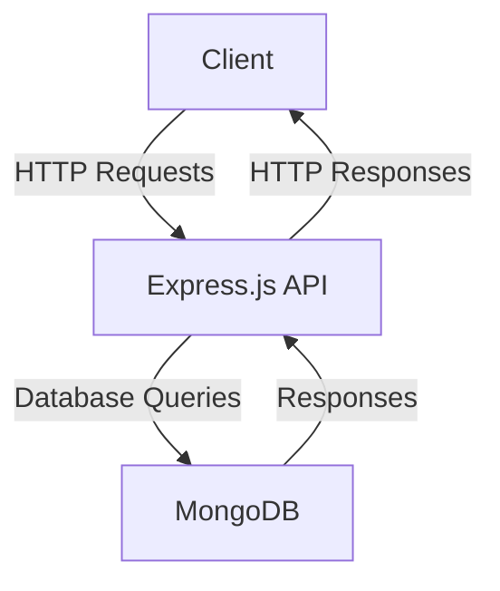
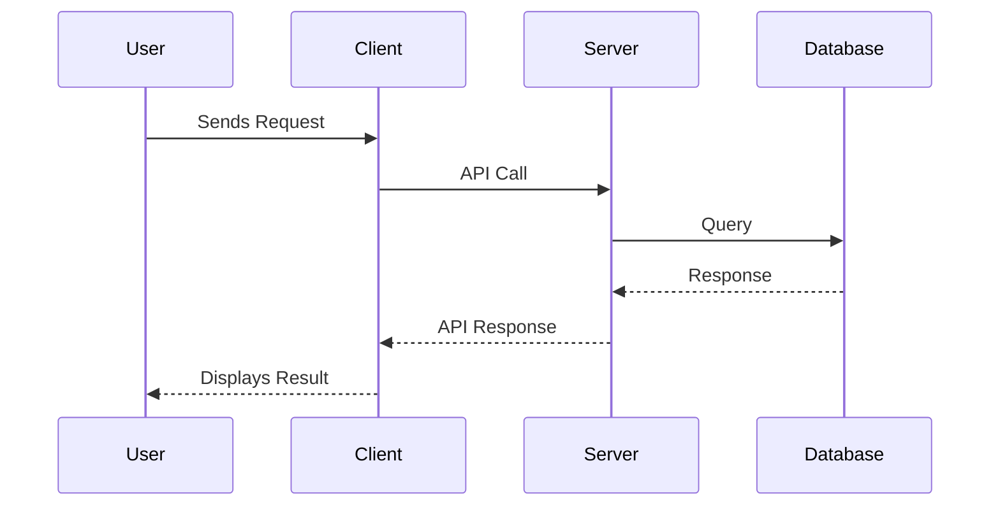

# Sample Node.js Application

This document provides an overview of a sample Node.js application, including its architecture and workflow. Diagrams are included to help visualize the system.

---

## Application Overview

The sample Node.js application is a web-based service that allows users to perform CRUD operations on a database. It uses the following technologies:

- **Node.js**: Backend runtime environment.
- **Express.js**: Web framework for building APIs.
- **MongoDB**: NoSQL database for data storage.

---

## Architecture Diagram

The following diagram illustrates the architecture of the application:



---

## Workflow Diagram

The workflow for a typical CRUD operation is shown below:



---

## Getting Started

To run the application locally, follow these steps:

1. Clone the repository:
   ```bash
   git clone https://github.com/your-repo/sample-nodejs-app.git
   cd sample-nodejs-app
   ```

2. Install dependencies:
   ```bash
   npm install
   ```

3. Start the application:
   ```bash
   npm start
   ```

4. Open your browser and navigate to `http://localhost:3000`.

---

## Reference Links

- [Node.js Documentation](https://nodejs.org/en/docs/)
- [Express.js Guide](https://expressjs.com/)
- [MongoDB Documentation](https://www.mongodb.com/docs/)
